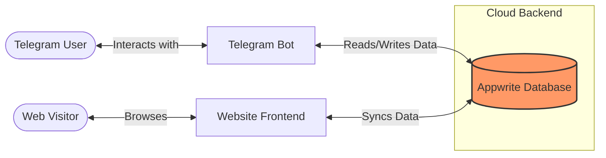

# Mutabaah Telegram Bot

This is a telegram bot that essentially acts as a wrapper for a deed tracker(mutabaah) website. It is linked together through a database hosted by [Appwrite](https://appwrite.io).

The Appwrite users database looks something like this:
| $id | telegram_username | telegram_id | data  |
|-----|-------------------|-------------|-------|
| 1   | johndoe           | 123         | {...} |
| 2   | solarft           | 456         | {...} |
| 3   | big_bean_can      | 789         | {...} |
